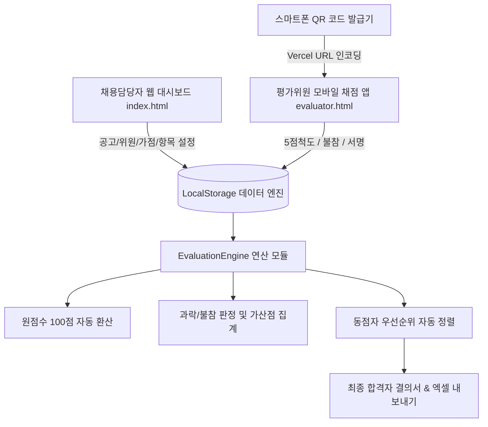

# 📄 제품 요구사항 정의서 (PRD: Product Requirements Document)

---

## 1. 제품 개요 (Product Overview)

### 1.1 제품명
**공공기관 및 기업 맞춤형 채용 평가 & 합격자 자동 결정 통합 시스템**  
*(Enterprise Institution Recruitment & Automated Decision System)*

### 1.2 개발 배경 및 목적
- **배경**: 기존 공공기관 및 대기업 채용 시 수기 종이 채점표 사용으로 인한 점수 오기입, 가산점 계산 오류, 불참자 채점 누락, 집계 지연 및 최종 결의서 작성 시간 소요 등 업무 비효율 발생.
- **목적**:
  1. 서류전형 및 면접전형 채점 과정을 모바일/태블릿 원터치 5점 척도 시스템으로 전환하여 위원 편의성 극대화.
  2. 원점수(25점) ➔ 100점 만점 자동 환산, 반영 비율 적용, 우대 가산점 합산, 과락 및 불참 처리, 최종 합격자/예비자 순위 결정을 실시간 자동화하여 인적 오류(Human Error) Zero화.
  3. 채용담당자가 엑셀 파일 내보내기/임포트, 전자서명 결의서 즉시 출력, 모바일 접속 QR 코드를 손쉽게 관리할 수 있는 무결성 채용 솔루션 제공.

### 1.3 타겟 사용자 및 이해관계자
1. **채용담당자 (Recruitment Officers)**: 채용 공고 생성, 전형별 평가위원/평가항목 설정, 우대 가점 규정 등록, 응시자 명단 관리, 실시간 집계 검수, 최종 합격자 결의서 및 엑셀 보고서 출력.
2. **평가위원 (Committee Evaluators)**: 스마트폰/태블릿으로 QR 코드를 스캔하여 접속한 뒤, 응시자 콤보박스 선택 ➔ 참여/불참 확인 ➔ 5점 척도 터치 채점 ➔ 터치 전자서명 제출.

---

## 2. 핵심 기능 사양 (Core Functional Specifications)

### 2.1 채용 공고 및 환경 설정 (Tab 1)
- **공고 다중 관리**: 신규 채용 공고 추가, 공고별 선발 정원(Pass Quota) 및 예비 정원(Wait Quota) 설정.
- **전형별 반영 비율**: 서류전형 비율(\(W_{doc}\)) + 면접전형 비율(\(W_{int}\)) = 100% 검증.
- **과락 기준선 설정**: 서류 과락 기준점수(\(C_{doc}\), 기본 60점) 및 면접 과락 기준점수(\(C_{int}\), 기본 60점).
- **위원 등록 관리**:
  - 서류전형 위원: 규정상 최대 2명 이내 (성명, 직책/소속 입력).
  - 면접전형 위원: 규정상 최대 5명 이내 (평가위원장, 내부/외부 위원 등).
- **5점 척도 평가 항목 관리**:
  - 서류 5개 항목, 면접 5개 항목 기본 제공 및 항목명/세부설명 자유 편집/추가/삭제.
- **가산점 및 우대 규정 관리 (Bonus Rules Editor)**:
  - 비율 가산(`percent`: 환산총점의 +N% 가산, 예: 보훈 5%, 장애인 3%) 및 점수 가산(`score`: +N점 직접 가산, 예: 전문자격증 +2점) 지원.

---

### 2.2 위원 전용 스마트 모바일 채점 앱 (`evaluator.html`)
- **스마트폰/태블릿 UI 반응형 최적화**: 360px ~ 430px 모바일 화면에서도 찌그러짐 없는 5분할 터치 그리드.
- **응시자 선택 콤보박스 (Combobox)**:
  - 수험번호 및 이름으로 원하는 지원자를 즉시 검색/이동 (`A-2026-001 홍길동 [완료✓]`).
  - 지원자 칩(Chip) 버튼과의 실시간 두 방향(Bi-directional) 동기화.
- **응시 참여 및 불참(결시) 선택 기능**:
  - `[ ✓ 정상 참여 ]`: 5개 항목별 5점 척도 터치 버튼 활성화.
  - `[ ✕ 불참 / 결시 ]`: 항목별 채점 생략 안내 표시, 총점 0점 처리 및 불참 과락 탈락 자동 처리.
- **원터치 5점 척도 (5-Point Likert Scale)**:
  - `5점(매우우수)`, `4점(우수)`, `3점(보통)`, `2점(미흡)`, `1점(매우미흡)` 직관적 블루 터치 피드백.
- **터치 전자서명 (Digital Signature)**:
  - Canvas 기반 터치/펜 서명 패드 (`touch-action: none` 적용으로 스크롤 쏠림 방지), 지우기 및 최종 제출.

---

### 2.3 실시간 자동 연산 및 무결성 검수 엔진 (Audit Engine)
- **원점수 환산 수식**:
  \[
  \text{환산점수(100점 만점)} = \left( \frac{\text{위원 원점수 합계}}{\text{최대 가능 원점수 (25점)}} \right) \times 100
  \]
- **전형별 평균 수식**:
  \[
  \text{전형 평균} = \frac{1}{N_{ev}} \sum_{i=1}^{N_{ev}} \text{환산점수}_i
  \]
- **최종 종합점수 연산 수식**:
  \[
  \text{최종 점수} = (\text{서류 평균} \times W_{doc}) + (\text{면접 평균} \times W_{int}) + \text{우대 가산점}
  \]
- **실시간 무결성 검수 (Audit System)**:
  - 항목 미입력 건수, 범위를 벗어난 점수 건수, 과락 발생자 수, 불참자 수를 실시간 감지하여 경고 바 및 뱃지로 표시.

---

### 2.4 합격자 동점자 처리 및 최종 판정 로직
- **우선순위 규정 (Tie-Breaking Rules)**:
  1. 과락 탈락자 및 불참자는 자동 후순위 처리 (`CUTOFF` / `ABSENT`).
  2. 최종 종합점수 고득점자 순.
  3. 동점자 발생 시 **면접전형 평균점수 고득점자** 우선.
  4. 면접점수 동점 시 **서류전형 평균점수 고득점자** 우선.
- **최종 판정 구획**:
  - `PASS` (합격): 정원(\(N_{pass}\)) 이내.
  - `WAIT` (예비합격): 예비 정원(\(N_{wait}\)) 이내 (예: 예비 1번, 예비 2번).
  - `FAIL` (불합격): 정원 초과.
  - `CUTOFF` (과락 탈락): 서류 또는 면접 과락 기준 미달.
  - `ABSENT` (불참 결시): 응시 전형 불참.

---

### 2.5 엑셀 패키지 & 모바일 QR 코드 엔진
- **모바일 접속 QR 코드**:
  - Vercel 라이브 URL (`https://input-three-liard.vercel.app/evaluator.html`) 전용 고화질 2D QR 코드 실시간 발급 및 안내문 인쇄 기능 (`window.print()`).
- **엑셀 내보내기 (SheetJS XLSX)**:
  - 서류전형 집계표, 면접전형 집계표, 최종 합격자 결정표, 전전형 통합 엑셀 패키지 다운로드.
- **지원자 엑셀 일괄 임포트 (Import)**:
  - `수험번호`, `성명`, `생년월일`, `연락처`, `가산점구분` 엑셀 양식 다운로드 및 대용량 일괄 등록.

---

## 3. 기술 아키텍처 (Technical Architecture)

### 3.1 기술 스택 (Tech Stack)
- **Frontend**: HTML5, Vanilla JavaScript (ES6+), Vanilla CSS3 (Custom CSS Tokens)
- **Icons**: Lucide Icons CDN
- **Excel Engine**: SheetJS (XLSX) CDN
- **QR Code Engine**: QRCode.js CDN & QRServer API
- **Deployment**: Vercel & GitHub Actions (`younsy1018-collab/input`)

---

## 4. 화면 설계 및 UX/UI 가이드라인

### 4.1 관리자 웹 대시보드 (`index.html`)
- **Tab 1 (공고·위원·항목 설정)**: 공고 정원, 과락선, 위원 명단, 5점 척도 항목, 가점 규칙 편집 테이블.
- **Tab 2 (위원 점수 입력)**: 위원별/지원자별 Matrix 점수판 및 입력 현황.
- **Tab 3 (실시간 집계 및 검수)**: 전형별 환산 점수 산출표, 가산점 반영표, 과락자 구분표.
- **Tab 4 (최종 합격자 결정표)**: 인쇄용 공식 의결서, 위원별 서명란, 동점자 사유 표시.
- **Tab 5 (지원자 명단 및 데이터)**: 지원자 등록 modal, 엑셀 템플릿 다운로드 및 일괄 업로드.

### 4.2 평가위원 스마트 앱 (`evaluator.html`)
- **헤더**: 전형 선택, 위원 이름 선택, 5점 척도 데이터 초기화 버튼.
- **응시자 선택 바**: 드롭다운 콤보박스 및 지원자 칩 터치바.
- **지원자 카드**: 인적사항, 정상 참여 / 불참 선택 버튼.
- **5점 척도 채점**: 5개 항목별 5~1점 모바일 원터치 버튼.
- **서명 패드**: 모바일 터치 서명 Canvas 및 제출 버튼.

---

## 5. 품질, 검수 및 컴플라이언스 (Quality & Compliance)

| 구분 | 검수 항목 | 합격 기준 |
|---|---|---|
| **데이터 무결성** | 미채점 항목 감지 | 0건일 때만 최종 확정 승인 |
| **과락 자동화** | 서류/면접 과락선 미달 처리 | 60점 미만 시 자동 CUTOFF 처리 |
| **불참 처리** | 불참 선택 응시자 | 점수 미부여 및 0점 과락 탈락 |
| **반응형 UX** | 모바일 가독성 및 터치 | 360px 모바일 화면 글자 찌그러짐 0% |
| **서명 검증** | 전자서명 누락 여부 | Canvas 드로잉 유무 확인 |

---

## 6. 향후 발전 로드맵 (Future Roadmap)

1. **v1.0 (현재)**: Vanilla JS / HTML5 기반 무결성 5점 척도 평가 시스템, 모바일 반응형 최적화, Vercel/GitHub 자동 배포.
2. **v1.5 (차기)**: Firebase / Supabase 클라우드 실시간 데이터베이스 연동 (멀티 기기 실시간 동기화).
3. **v2.0**: 블록체인 기반 평가 결과 위변조 방지 타임스탬프 기능 및 공공기관 ERP 연동 API 구축.
